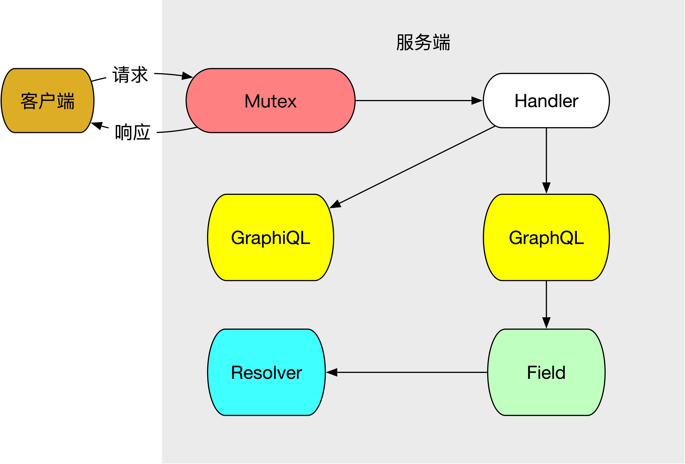

#前言

首先，有必要做个说明。
前段时间由于受samsarahq的GraphQL实现库*thunder*的启发，我自己也参照着写了个GraphQL的实现。
虽然因为个人能力有限，多有错漏之处尚未发现，但总要用的，不然如何发现隐患呢？
于是再三思考，决定重新写这一系列，一方面是更换了实现库，另一方面也是近来看到了自己之前所写的不足，决心要改改。

#整体规划

##功能需求

之前所写，需求不明，只写明了是课业，要仿照简书做个简化版的，但具体要做些什么均未详细介绍。
这是做事的大忌，若连自己要做什么都不知道，又怎么能成事呢。

因此，这次我们就先来厘清需求。

因为我们是简书的简化版，最主要的功能就是发布文章，以及对文章进行评论、回复和点赞。
那么围绕这一主旨，我们轻易可知，这个简化版简书（后面统一称为简书）最首要的，其实是用户管理的功能。
因为只有注册的用户，才能够进行文章的发布，评论等。所以第一个需求点，就是用户的注册，登录，退出。
那么用户注册之后，就可以进行发布文章了。自然发布文章就是第二个功能点。文章可以被评论，评论可以被回复，
而这三者都可以被点赞，这是接下来的三个功能点，评论，回复，点赞。
用户以及访客进入网站，可以浏览文章，评论等内容，这是最后的功能点。
可以看到，我们这个简书，所要做的确实简化了很多。

##技术方案

如上所言，整体的功能非常之简单，对应的设计方案自然也复杂不到哪里去。



如图所示，我们的请求从客户端来，进入Go后台的Mutex多路复用器。由于GraphQL只需要一个路由地址即可，
所以我们的Handler基本上只有一个，不过这里为了调试，还引入了GraphiQL，所以会多一个。
对GraphQL的请求，在经过GraphQL的解析后，会映射到不同字段对应的Resolver函数上，而我们的业务逻辑，
基本上就是写在Resolve函数中了。

这次的简书项目，我们将采用前后端分离的模式，前段将采用React+Typescript实现。

##数据模型

在我们的需求中，所需求的数据模型应有：

- 用户（user）
- 文章（article）
- 评论（comment）
- 回复（reply）
- 点赞（like）

在这个项目中，我们将使用Postgres数据库

###用户

```postgresql
-- Drop table

-- DROP TABLE public."user";

CREATE TABLE public."user" (
	id int8 NOT NULL, -- ID
	username varchar(32) NOT NULL, -- 用户名
	email varchar(32) NOT NULL, -- 注册邮箱
	"password" varchar(255) NOT NULL, -- 密码
	avatar varchar(127) NOT NULL, -- 头像
	gender int2 NOT NULL DEFAULT 3, -- 性别：'man'-男,'woman'-女,'unknown'-保密
	introduce text NULL, -- 个人简介
	state int2 NOT NULL DEFAULT 1, -- 状态:'unsign'-未认证,'normal'-正常,'forbidden'-禁止发言,'freeze'-冻结
	root bool NOT NULL DEFAULT false, -- 是否管理员
	created_at timestamp NOT NULL DEFAULT CURRENT_TIMESTAMP, -- 创建时间
	updated_at timestamp NOT NULL DEFAULT CURRENT_TIMESTAMP, -- 更新时间
	deleted_at timestamp NULL, -- 删除时间
	CONSTRAINT user_email_key UNIQUE (email),
	CONSTRAINT user_pkey PRIMARY KEY (id),
	CONSTRAINT user_username_key UNIQUE (username)
);

-- Column comments

COMMENT ON COLUMN public."user".id IS 'ID';
COMMENT ON COLUMN public."user".username IS '用户名';
COMMENT ON COLUMN public."user".email IS '注册邮箱';
COMMENT ON COLUMN public."user"."password" IS '密码';
COMMENT ON COLUMN public."user".avatar IS '头像';
COMMENT ON COLUMN public."user".gender IS '性别：''man''-男,''woman''-女,''unknown''-保密';
COMMENT ON COLUMN public."user".introduce IS '个人简介';
COMMENT ON COLUMN public."user".state IS '状态:''unsign''-未认证,''normal''-正常,''forbidden''-禁止发言,''freeze''-冻结';
COMMENT ON COLUMN public."user".root IS '是否管理员';
COMMENT ON COLUMN public."user".created_at IS '创建时间';
COMMENT ON COLUMN public."user".updated_at IS '更新时间';
COMMENT ON COLUMN public."user".deleted_at IS '删除时间';

-- Drop table

-- DROP TABLE public.user_count;

CREATE TABLE public.user_count (
	uid int8 NOT NULL, -- 用户ID
	fans_num int4 NOT NULL DEFAULT 0, -- 粉丝数
	follow_num int4 NOT NULL DEFAULT 0, -- 关注数（关注其他用户）
	article_num int4 NOT NULL DEFAULT 0, -- 文章数
	words int4 NOT NULL DEFAULT 0, -- 字数
	like_num int4 NOT NULL DEFAULT 0, -- 被赞数
	created_at timestamp NOT NULL DEFAULT CURRENT_TIMESTAMP, -- 创建时间
	updated_at timestamp NOT NULL DEFAULT CURRENT_TIMESTAMP, -- 更新时间
	deleted_at timestamp NULL, -- 删除时间
	CONSTRAINT user_count_pkey PRIMARY KEY (uid)
);

-- Column comments

COMMENT ON COLUMN public.user_count.uid IS '用户ID';
COMMENT ON COLUMN public.user_count.fans_num IS '粉丝数';
COMMENT ON COLUMN public.user_count.follow_num IS '关注数（关注其他用户）';
COMMENT ON COLUMN public.user_count.article_num IS '文章数';
COMMENT ON COLUMN public.user_count.words IS '字数';
COMMENT ON COLUMN public.user_count.like_num IS '被赞数';
COMMENT ON COLUMN public.user_count.created_at IS '创建时间';
COMMENT ON COLUMN public.user_count.updated_at IS '更新时间';
COMMENT ON COLUMN public.user_count.deleted_at IS '删除时间';

-- Drop table

-- DROP TABLE public.user_follow;

CREATE TABLE public.user_follow (
	id int8 NOT NULL, -- ID
	uid int8 NOT NULL, -- 用户ID
	fuid int8 NOT NULL, -- 粉丝ID
	created_at timestamp NOT NULL DEFAULT CURRENT_TIMESTAMP, -- 创建时间
	updated_at timestamp NOT NULL DEFAULT CURRENT_TIMESTAMP, -- 更新时间
	deleted_at timestamp NOT NULL, -- 删除时间
	CONSTRAINT uq_uid_fuid UNIQUE (uid, fuid, deleted_at),
	CONSTRAINT user_follow_pkey PRIMARY KEY (id)
);

-- Column comments

COMMENT ON COLUMN public.user_follow.id IS 'ID';
COMMENT ON COLUMN public.user_follow.uid IS '用户ID';
COMMENT ON COLUMN public.user_follow.fuid IS '粉丝ID';
COMMENT ON COLUMN public.user_follow.created_at IS '创建时间';
COMMENT ON COLUMN public.user_follow.updated_at IS '更新时间';
COMMENT ON COLUMN public.user_follow.deleted_at IS '删除时间';
```

###文章

```postgresql
-- Drop table

-- DROP TABLE public.article;

CREATE TABLE public.article (
	id int8 NOT NULL, -- 主键
	sn varchar(32) NOT NULL, -- 文章序号
	title varchar(255) NOT NULL, -- 文章标题
	uid int8 NOT NULL, -- 作者id
	cover varchar(255) NULL, -- 封面
	"content" text NOT NULL, -- 内容，markdown格式
	state int2 NOT NULL DEFAULT 1, -- 状态:'1'-未审核,'2'-已上线,'3'-已下线,'4'-已删除
	created_at timestamp NOT NULL DEFAULT CURRENT_TIMESTAMP, -- 创建时间
	updated_at timestamp NOT NULL DEFAULT CURRENT_TIMESTAMP, -- 更新时间
	deleted_at timestamp NOT NULL, -- 删除时间
	CONSTRAINT article_pkey PRIMARY KEY (id),
	CONSTRAINT sn UNIQUE (sn)
);
CREATE INDEX article_title_idx ON public.article USING btree (title);
CREATE INDEX article_uid_idx ON public.article USING btree (uid);

-- Column comments

COMMENT ON COLUMN public.article.id IS '主键';
COMMENT ON COLUMN public.article.sn IS '文章序号';
COMMENT ON COLUMN public.article.title IS '文章标题';
COMMENT ON COLUMN public.article.uid IS '作者id';
COMMENT ON COLUMN public.article.cover IS '封面';
COMMENT ON COLUMN public.article."content" IS '内容，markdown格式';
COMMENT ON COLUMN public.article.state IS '状态:''1''-未审核,''2''-已上线,''3''-已下线,''4''-已删除';
COMMENT ON COLUMN public.article.created_at IS '创建时间';
COMMENT ON COLUMN public.article.updated_at IS '更新时间';
COMMENT ON COLUMN public.article.deleted_at IS '删除时间';

-- Drop table

-- DROP TABLE public.article_ex;

CREATE TABLE public.article_ex (
	aid int8 NOT NULL, -- 文章ID
	view_num int4 NOT NULL DEFAULT 0, -- 浏览数
	cmt_num int4 NOT NULL DEFAULT 0, -- 评论数
	like_num int4 NOT NULL DEFAULT 0, -- 点赞数
	created_at timestamp NOT NULL DEFAULT CURRENT_TIMESTAMP, -- 创建时间
	updated_at timestamp NOT NULL DEFAULT CURRENT_TIMESTAMP, -- 更新时间
	deleted_at timestamp NOT NULL, -- 删除时间
	CONSTRAINT article_ex_pk PRIMARY KEY (aid)
);

-- Column comments

COMMENT ON COLUMN public.article_ex.aid IS '文章ID';
COMMENT ON COLUMN public.article_ex.view_num IS '浏览数';
COMMENT ON COLUMN public.article_ex.cmt_num IS '评论数';
COMMENT ON COLUMN public.article_ex.like_num IS '点赞数';
COMMENT ON COLUMN public.article_ex.created_at IS '创建时间';
COMMENT ON COLUMN public.article_ex.updated_at IS '更新时间';
COMMENT ON COLUMN public.article_ex.deleted_at IS '删除时间';
```

### 评论

```postgresql
-- Drop table

-- DROP TABLE public."comment";

CREATE TABLE public."comment" (
	id int8 NOT NULL, -- id
	aid int8 NOT NULL, -- 文章ID
	uid int8 NOT NULL, -- 评论用户id
	"content" text NOT NULL, -- 评论内容
	like_num int4 NOT NULL DEFAULT 0, -- 被赞数
	floor int4 NOT NULL DEFAULT 1, -- 第几楼
	state int2 NOT NULL DEFAULT 1, -- 状态:'1'-未审核,'2'-已上线,'3'-已下线,'4'-已删除
	created_at timestamp NOT NULL DEFAULT CURRENT_TIMESTAMP, -- 创建时间
	updated_at timestamp NOT NULL DEFAULT CURRENT_TIMESTAMP, -- 更新时间
	deleted_at timestamp NOT NULL, -- 删除时间
	CONSTRAINT comment_pkey PRIMARY KEY (id),
	CONSTRAINT uq_aidfloor UNIQUE (aid, floor)
);

-- Column comments

COMMENT ON COLUMN public."comment".id IS 'id';
COMMENT ON COLUMN public."comment".aid IS '文章ID';
COMMENT ON COLUMN public."comment".uid IS '评论用户id';
COMMENT ON COLUMN public."comment"."content" IS '评论内容';
COMMENT ON COLUMN public."comment".like_num IS '被赞数';
COMMENT ON COLUMN public."comment".floor IS '第几楼';
COMMENT ON COLUMN public."comment".state IS '状态:''1''-未审核,''2''-已上线,''3''-已下线,''4''-已删除';
COMMENT ON COLUMN public."comment".created_at IS '创建时间';
COMMENT ON COLUMN public."comment".updated_at IS '更新时间';
COMMENT ON COLUMN public."comment".deleted_at IS '删除时间';
```

###回复

```postgresql
-- Drop table

-- DROP TABLE public.comment_reply;

CREATE TABLE public.comment_reply (
	id int8 NOT NULL, -- id
	cid int8 NOT NULL, -- 评论id
	uid int8 NOT NULL, -- 回复人id
	"content" text NOT NULL, -- 回复内容
	state int2 NOT NULL DEFAULT 1, -- 状态:'1'-未审核,'2'-已上线,'3'-已下线,'4'-已删除
	created_at timestamp NOT NULL DEFAULT CURRENT_TIMESTAMP, -- 创建时间
	updated_at timestamp NOT NULL DEFAULT CURRENT_TIMESTAMP, -- 更新时间
	deleted_at timestamp NOT NULL, -- 删除时间
	CONSTRAINT comment_reply_pkey PRIMARY KEY (id)
);
CREATE INDEX idx_cid ON public.comment_reply USING btree (cid);

-- Column comments

COMMENT ON COLUMN public.comment_reply.id IS 'id';
COMMENT ON COLUMN public.comment_reply.cid IS '评论id';
COMMENT ON COLUMN public.comment_reply.uid IS '回复人id';
COMMENT ON COLUMN public.comment_reply."content" IS '回复内容';
COMMENT ON COLUMN public.comment_reply.state IS '状态:''1''-未审核,''2''-已上线,''3''-已下线,''4''-已删除';
COMMENT ON COLUMN public.comment_reply.created_at IS '创建时间';
COMMENT ON COLUMN public.comment_reply.updated_at IS '更新时间';
COMMENT ON COLUMN public.comment_reply.deleted_at IS '删除时间';
```

###点赞

```postgresql
-- Drop table

-- DROP TABLE public.like;

CREATE TABLE public.like (
	id int8 NOT NULL, -- id
	uid int8 NOT NULL, -- 点赞用户id
	objtype int2 NOT NULL, -- 被点赞对象:'1'-文章，'2'-评论，'3'-回复
	objid int8 NOT NULL, -- 被赞对象id
	created_at timestamp NOT NULL DEFAULT CURRENT_TIMESTAMP, -- 创建时间
	updated_at timestamp NOT NULL DEFAULT CURRENT_TIMESTAMP, -- 更新时间
	deleted_at timestamp NOT NULL, -- 删除时间
	CONSTRAINT uq_u_obj UNIQUE (uid, objtype, objid),
	CONSTRAINT like_pkey PRIMARY KEY (id)
);

-- Column comments

COMMENT ON COLUMN public.like.id IS 'id';
COMMENT ON COLUMN public.like.uid IS '点赞用户id';
COMMENT ON COLUMN public.like.objtype IS '被点赞对象:''1''-文章，''2''-评论，''3''-回复';
COMMENT ON COLUMN public.like.objid IS '被赞对象id';
COMMENT ON COLUMN public.like.created_at IS '创建时间';
COMMENT ON COLUMN public.like.updated_at IS '更新时间';
COMMENT ON COLUMN public.like.deleted_at IS '删除时间';
```