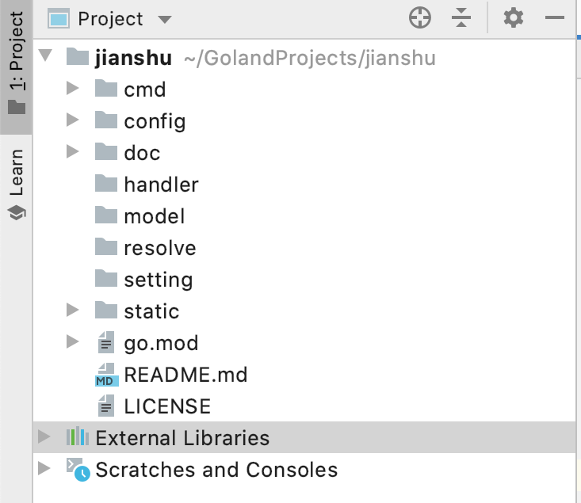
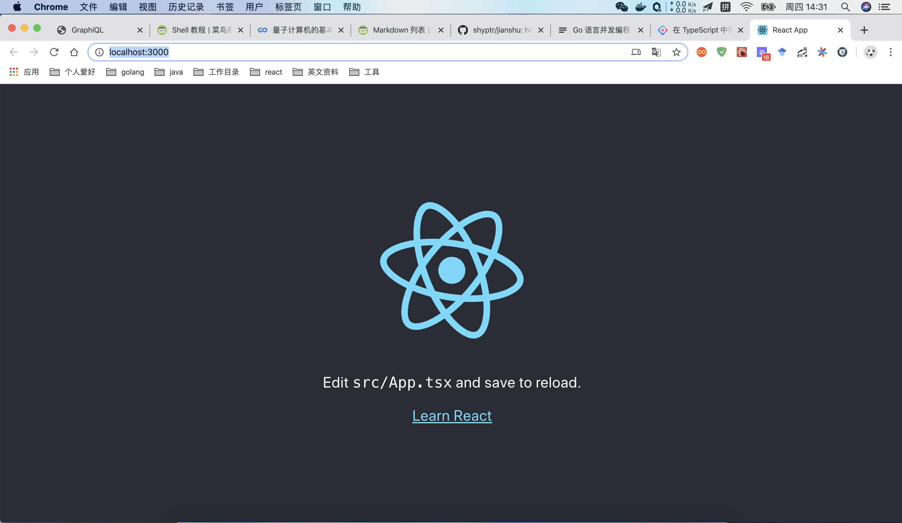

#后端初始化

##新建项目
我们在github上新建项目jianshu。
<br/>
<br/>
将项目克隆到本地
    
    git clone https://github.com/shyptr/jianshu.git

新建目录层级如下：



<br/>
目录含义：

- cmd/jianshu: 项目启动路径
- config: 配置文件路径
- handler: 路由函数
- model: 数据模型
- resolve: GraphQL解析函数
- setting: 全局配置
- static: 静态资源

<br/>
使用go module初始化项目
    
    go mod init github.com/shyptr/jianshu
    
##单例模式设置全局配置

在config目录下，新建配置文件conf.toml:
```toml
[app]
jwt_secret = "secure"

# 定义 HTTP 监听端口
[http]
port = "8008"

# 存储配置,使用Postgres
[storage]
user = "admin"
password = "admin"
host = "localhost"
port = 5432
dbname = "postgres"
```

在setting目录下，新建setting.go文件,添加如下内容：
```go
package setting

type Storage interface {
	Host() string
	Port() int
	Username() string
	Password() string
	DBName() string
}

type storageConfig struct {
	Host     string `json:"host"`
	Port     int    `json:"port"`
	Username string `json:"user"`
	Password string `json:"password"`
	DBName   string `json:"dbname"`
}

func (s storageConfig) Host() string {
	return s.host
}

func (s storageConfig) Port() int {
	return s.port
}

func (s storageConfig) Username() string {
	return s.username
}

func (s storageConfig) Password() string {
	return s.password
}

func (s storageConfig) DBName() string {
	return s.dbname
}
```

这里我们使用接口Storage来访问存储配置

接着开始读取配置文件：

```go
var (
	jwtSecret string
	httpPort  int
	storage   storageConfig
	once      sync.Once
)

func Init() {
	once.Do(func() {
		viper.AddConfigPath("config")
		err := viper.ReadInConfig()
		if err != nil {
			log.Fatalf("读取配置文件出错：%s", err)
		}

		//设置默认值
		viper.SetDefault("app.jwt_secret", "secure")
		viper.SetDefault("http.port", 8008)

		// 读取配置内容
		jwtSecret = viper.GetString("app.jwt_secret")
		httpPort = viper.GetInt("http.port")
		err = viper.UnmarshalKey("storage", &storage, func(config *mapstructure.DecoderConfig) {
			config.TagName = "json"
		})
		if err != nil {
			log.Fatalf("读取数据库配置信息出错：%s", err)
		}
	})
}

func GetJwtSecret() string {
	return jwtSecret
}

func GetHttpPort() int {
	return httpPort
}

func GetStorage() Storage {
	return storage
}
```

在简书项目中，我们使用viper库来处理配置文件。通过

    viper.AddConfigPath("config")
将本地目录config添加到解析路径中，即可完成对配置文件的解析。

可以看到，我们定义了一个叫once的私有全局变量，类型是sync.Once。sync.Once是标准库中sync包下的一个基本的同步原语。
它可以保证，在Go程序运行期间，其通过Do方法接收到的Func内部的代码，只会执行一次。在本质上，它是使用的互斥锁完成的。有兴趣的可以自己去了解一下。

在我们这段代码中，对于配置文件的解析，由于使用了Once，所以即使Init函数被多次调用，内部逻辑也只会执行一次。

##建立logger池

出于性能上的一点考虑，我们可以假设一个场景，如果我们针对每一次请求都New一个logger出来的话，当大量的请求同时到来时，那将是一场灾难。
所以在项目中，我们对于logger，使用sync包中的Pool进行池化。将每一次请求New出来的logger都放回池中，以实现复用。

新建util包，新建logger.go文件，代码如下。

```go
package util

import (
	"fmt"
	"github.com/rs/zerolog"
	"os"
	"strings"
	"sync"
	"time"
)

var (
	logPool sync.Pool
	once    sync.Once
)

func InitLog() {
	once.Do(func() {
		logOutPut := zerolog.ConsoleWriter{Out: os.Stdout, TimeFormat: time.RFC3339}
		logOutPut.FormatLevel = func(i interface{}) string {
			return strings.ToUpper(fmt.Sprintf("| %-6s|", i))
		}
		logOutPut.FormatMessage = func(i interface{}) string {
			if i != nil {
				return fmt.Sprintf("***%s****", i)
			}
			return ""
		}
		logOutPut.FormatFieldName = func(i interface{}) string {
			return fmt.Sprintf("%s:", i)
		}
		logOutPut.FormatFieldValue = func(i interface{}) string {
			return strings.ToUpper(fmt.Sprintf("%s", i))
		}

		logPool.New = func() interface{} {
			return zerolog.New(logOutPut).With().Timestamp().Logger()
		}
	})
}

func GetLogger() zerolog.Logger {
	logger := logPool.Get()
	if logger == nil {
		InitLog()
	}
	logger = logPool.Get()
	return logger.(zerolog.Logger)
}

func PutLogger(logger zerolog.Logger) {
	logPool.Put(logger)
}
```

##初始化数据库连接

对于数据库的操作，简书项目中将使用sqlx进行数据库访问，sqlex进行sql构建。

在model目录下新建文件db.go，添加内容如下：
```go
package model

import (
	"fmt"
	"github.com/jmoiron/sqlx"
	_ "github.com/lib/pq"
	"github.com/rs/zerolog"
	"github.com/shyptr/jianshu/setting"
	"github.com/shyptr/jianshu/util"
	"github.com/shyptr/plugins/sqlog"
	"github.com/shyptr/sqlex"
	"sync"
	"time"
)

type sqloger struct {
	logger zerolog.Logger
}

func (s sqloger) BeforeInFoLog(query string, args ...interface{}) {}

func (s sqloger) AfterInFoLog(executeTime time.Duration, query string, args ...interface{}) {
	s.logger.Info().Dur("executeTime", executeTime).Interface("[SQL]", fmt.Sprintf("%v : %v", query, args)).Send()
}

func (s sqloger) Async() bool {
	return false
}

func (s sqloger) Show() bool {
	return true
}

var (
	DB   *sqlog.DB
	PSql sqlex.StatementBuilderType
	once sync.Once
)

func Init() {
	s := setting.GetStorage()
	pi := fmt.Sprintf("host=%s port=%d user=%s password=%s dbname=%s sslmode=disable",
		s.GetHost(), s.GetPort(), s.GetUsername(), s.GetPassword(), s.GetDBName())
	db := sqlx.MustOpen("postgres", pi)
	DB = &sqlog.DB{Runner: db, Logger: sqloger{logger: util.GetLogger()}}
	PSql = sqlex.StatementBuilder.PlaceholderFormat(sqlex.Dollar)
}
```

在项目中，使用sqlog对sqlx的操作进行了一次封装，用于自定义打印sql。

由于我们使用的是postgres数据库，所以sqlex中sql构建方式选择Dollar（$1,$2），而非默认的问号（？）


## 项目启动

现在我们要完成后端项目初始化的最后一步了——编写main文件。

```go
package main

import (
	"context"
	"fmt"
	"github.com/shyptr/graphql"
	"github.com/shyptr/graphql/middleware"
	"github.com/shyptr/jianshu/model"
	"github.com/shyptr/jianshu/setting"
	"github.com/shyptr/jianshu/util"
	"net/http"
	"os"
	"os/signal"
	"time"
)

func init() {
	setting.Init()
	util.InitLog()
	model.Init()
}

func main() {
	graphql.Use(middleware.Logger(), middleware.Recovery())
	mux := http.DefaultServeMux
	addr := fmt.Sprintf(":%d", setting.GetHttpPort())
	server := http.Server{
		Addr:         addr,
		Handler:      mux,
		MaxHeaderBytes: 1 << 20,
	}

	logger := util.GetLogger()
	go func() {
		logger.Info().Msgf("server run on:%s", addr)
		if err := server.ListenAndServe(); err != nil {
			logger.Fatal().AnErr("Server Error", err).Send()
		}
	}()

	quit := make(chan os.Signal)
	signal.Notify(quit, os.Interrupt, os.Kill)
	<-quit
	logger.Info().Msg("Shutdown Server ...")
	ctx, cancel := context.WithTimeout(context.Background(), 5*time.Second)
	defer cancel()
	if err := server.Shutdown(ctx); err != nil {
		logger.Fatal().Caller().Err(err).Msg("Server Shutdown")
	}
	logger.Info().Msg("Server exiting")
}
```

在main文件中，我们使用http包提供的默认多路复用器来做路由的映射。当然这里还没有涉及路由，只是简单将项目启动起来。
可以看到，我们开启了一个goruntine来启动http服务，而在main协程中，使用signal包的Notify函数，监听系统信号，若出现进程被kill或者中断的情况，等待了5秒才停止程序。
这是是为了防止，在程序退出时还有未完成任务。

到此我们项目的初始化就完成了，后续关于数据模型的构建和数据库操作，将会和具体的resolve结合，而不是单独写。

#前端初始化

对于前端方面，我们采用了react+typescript进行编写，UI库选择antd。

## 使用脚手架创建项目

在这里，我们默认已经安装了node.js和yarn。

使用yarn创建janshu项目。
    
    $ yarn create react-app jianshu --template typescript

等待创建完成后，进入项目路径，并启动项目。

    $ cd jisnhu
    $ yarn start

此时会自动打开浏览器，访问 http://localhost:3000,看到如下图就算成功了。



## 引入antd

安装antd。

    $ yarn add antd

因为antd是个很大的UI库，如果一次性引入的话，就会对前端造成负担，所以这里我们将配置babel来完成按需引入。

    $ yarn add babel-plugin-import

使用如上命令安装babel-plugin-import，在项目目录下新建config-overrides.js 文件。

```javascript
const { override, fixBabelImports } = require('customize-cra');

module.exports = override(
   fixBabelImports('import', {
     libraryName: 'antd',
     libraryDirectory: 'es',
     style: 'css',
   }),
 );
```

安装完成后，我们进入src目录，修改App.tsx。

```typescript
import { Button } from 'antd';

function App() {
  return (
    <div className="App">
      <header className="App-header">
        
		<Button type="primary">I'm a Antd Button</Button>
        <p>
          Edit <code>src/App.tsx</code> and save to reload.
        </p>
        <a
          className="App-link"
          href="https://reactjs.org"
          target="_blank"
          rel="noopener noreferrer"
        >
          Learn React
        </a>
      </header>
    </div>
  );
}
```

再次启动项目，可以看到一个按钮在中间，就完成了。

有时候我们会想要配置自己的主题颜色，可以参照https://ant.design/docs/react/customize-theme-cn 进行配置。